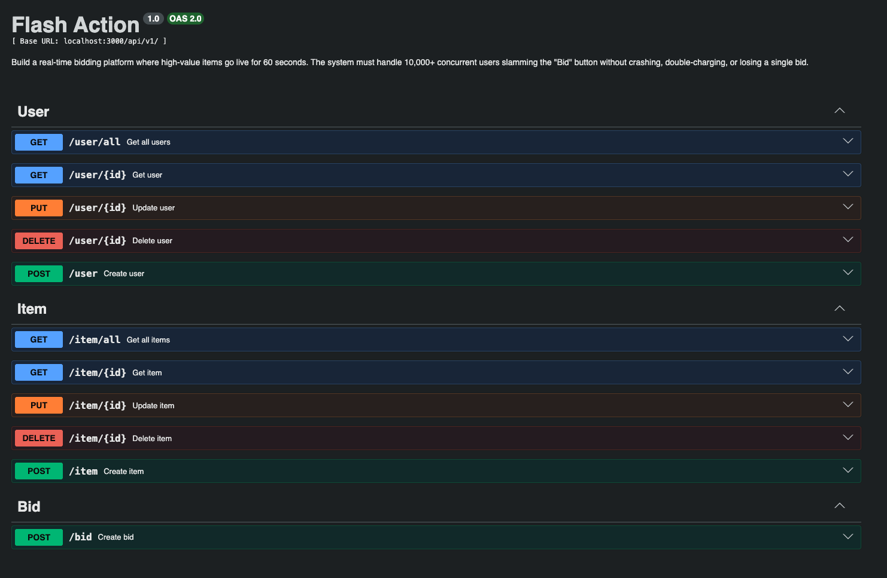

## 🚀 Project Blueprint: The Flash Auction Engine

## Phase 1:

For more information about the project, check out the [README_PROJECT.md](README_PROJECT.md)

### 🛠️ The Tech Stack
* Backend: Node.js (Express)
* Primary DB: PostgreSQL (For users, items, and final orders)

### 🎯 Goal

* Make it work for one user.
* Create a basic CRUD for Items and Users.
* Implement a simple POST /bid endpoint that updates a SQL row.
* The Trap: At this stage, your app will work perfectly for you, but it will explode the moment 100 people bid at once.

### Run the app

`Base URL`: http://localhost:3000/api/v1

Navigate to `backend` project folder, and run the following commands:

#### Local environment

1. Run `npm install` to install dependencies.
2. Run `npm start` to start the app.

The app will be available at http://localhost:3000 (unless process env variables are changed).

#### Docker environment

1. Run the build with the command:

`docker build -t flash-auction:1.0.0`

1. Run `docker-compose up` to start the app. 

    (add `-d` to run in detached mode)

2. Run `docker-compose down` to stop the app.

   (add `-v` to remove volumes also)

The app will be available at http://localhost:3000 (unless process env variables are changed).

#### Endpoints 
You can see the endpoints by running app, and then navigate to http://localhost:3000/api/v1/docs which will present swagger documentation.

With swagger documentation, you can try out the endpoints.

The endpoints are:

`User`
* `GET` /user/all – List all users
* `GET` /user/:id – Get user by id
* `POST` /user – Create the new user
* `PUT` /user/:id – Update user based on id
* `DELETE` /user/:id – Delete user based on id

`Item`
* `GET` /item/all – List all items
* `GET` /item/:id – Get item by id
* `POST` /item – Create the new item
* `PUT` /item/:id – Update item based on id
* `DELETE` /item/:id – Delete item based on id

`Bid`
* `POST` /bid – Bid on item

