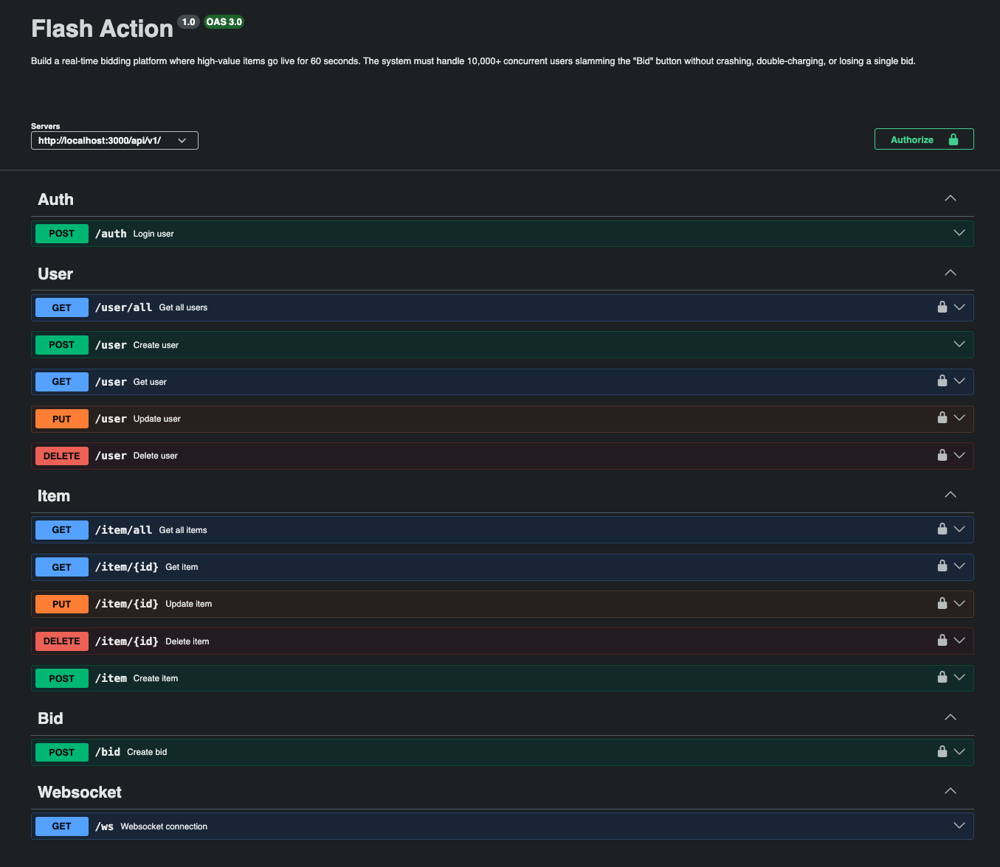

## 🚀 Project Blueprint: The Flash Auction Engine

## Phase 2:

For more information about the project, check out the [README_PROJECT.md](README_PROJECT.md)

For phase 1 of the project, check out the [README_PHASE1.md](README_PHASE_1.md)

### 🛠️ The Tech Stack
* Backend: Node.js (Express)
* Primary DB: PostgreSQL (For users, items, and final orders)
* Redis (For real-time updates)
* Frontend: Angular (For the UI)

### Requirements
* Node.js (Express) 
* PostgreSQL (DB)
* Redis (Cache)
* Angular (Frontend)
* Postman (For testing)

### 🎯 Goal

Handle the "Bidding War."

* Pattern: Atomic Counters. Move the "Current High Bid" from SQL to Redis.
* Logic: Use a Lua script in Redis to check if new_bid > current_high_bid. If yes, update it in one atomic step.
* Real-time: Use WebSockets to broadcast the new high bid to all connected users instantly.
* Challenge: Implement Debouncing on the frontend so a user can't spam the API faster than the network can handle.

### Run the app


`Base URL`: http://localhost:3000/api/v1


#### Local environment

Navigate to `backend` project folder, and run the following commands:

##### Backend
1. Run `npm install` to install dependencies.
2. Run `npm start` to start the app.

The app will be available at http://localhost:3000 (unless process env variables are changed).

`Swagger URL`: http://localhost:3000/api/v1/docs
`WebSocket URL`: http://localhost:3000/api/v1/ws

```
|**********************|
|* !!! !!!!!!!!! !!!  *|
|* !!! IMPORTANT !!!  *|
|* !!! !!!!!!!!! !!!  *|
|**********************|
```

You should also setup and Redis instance.
You can use Docker to run Redis or install it locally.

Once you have Redis running, you need to set a password for it.
You can do this by running the following commands:
```
redis-cli
```
Once inside the redis-cli, run the following command:
```
ACL SETUSER redisuser on >redissecretpassword ~* &* +@all
```
_Note: You can change the username and password to whatever you want, based on your .env file._

```
exit
```
- To exit redis-cli.
##### Frontend
Navigate to `frontend` project folder, and run the following commands:
    1. Run `npm install` to install dependencies.
    2. Run `npm start` to start the app.

The app will be available at http://localhost:4200 (unless process env variables are changed).

#### Docker environment

1. Run `docker-compose up` to start the app.

   (add `-d` to run in detached mode)

2. Run `docker-compose down` to stop the app.

   (add `-v` to remove volumes also)

`Docker Compose` will start:
- Frontend (http://localhost:4200)
- Backend server (http://localhost:3000)
- Database server
- Redis server

The frontend app will be available at http://localhost:4200 (unless process env variables are changed).

The backend app will be available at http://localhost:3000 (unless process env variables are changed).

#### Endpoints 
You can see the endpoints by running app, and then navigate to http://localhost:3000/api/v1/docs which will present swagger documentation.

With swagger documentation, you can try out the endpoints.

The endpoints are:
`Auth`
* `POST` /auth - Login with email and password

`User`
* `GET` /user/all – List all users
* `GET` /user – Get user by id
* `POST` /user – Create the new user
* `PUT` /user – Update user based on id
* `DELETE` /user – Delete user based on id

`Item`
* `GET` /item/all – List all items
* `GET` /item/:id – Get item by id
* `POST` /item – Create the new item
* `PUT` /item/:id – Update item based on id
* `DELETE` /item/:id – Delete item based on id

`Bid`
* `POST` /bid – Bid on item

`Websocket`
* `WSS` /ws – Connect to websocket




